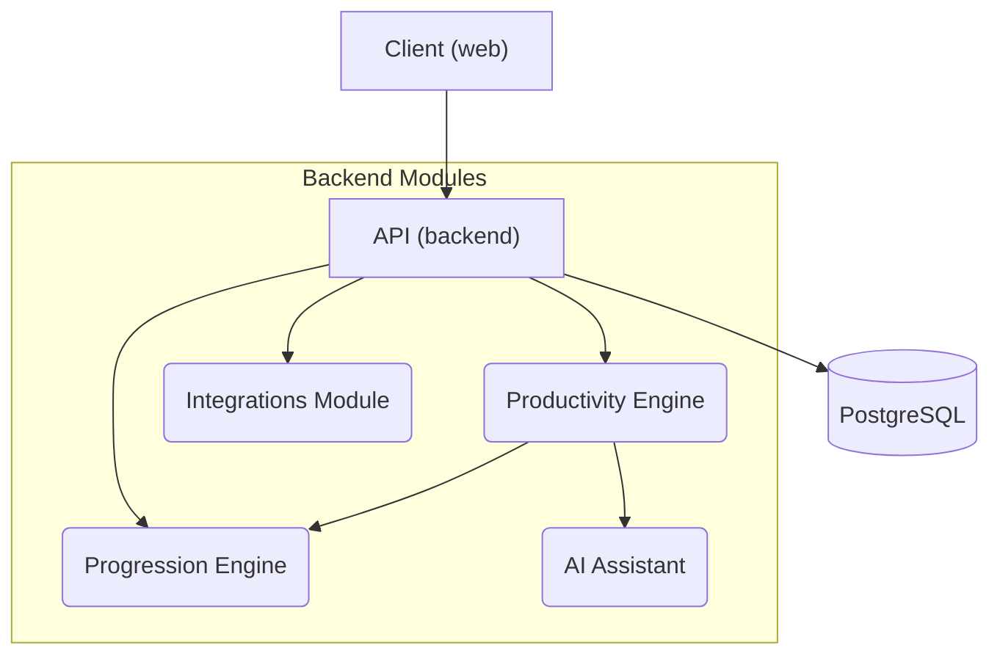

## Project Overview

LARP (provisional codename) is a personal productivity tracker system, that blends elements from RPG progression and real-world data.

Some of core features include:
- task manager
- habit tracking
- planning
- pomodoro
- work/focus time tracking
- xp/levels
- stats
- physical activity and body improvement tracking
- goals setting
- integrations to automatize metric retrieving and easy usability
- ai assistant

## Tech Stack

- frontend: pnpm + ts + react + tanstack
- backend: uv + python + fastapi
- database: postgresql
- ci/cd: github actions
- tests: vitest + pytest
- linter/formatter: biome + ruff 
- containerization/orchestration: docker + docker compose

## Project Strucutre

api/ - fastapi project 
docs/ - all documentation 
    docs/specs - specs to be implemented
    docs/adr - architecture decision records 
    docs/design - design decisions docs
    docs/contracts - contracts decisions docs
web/ - frontend react 

## Architecture Overview

