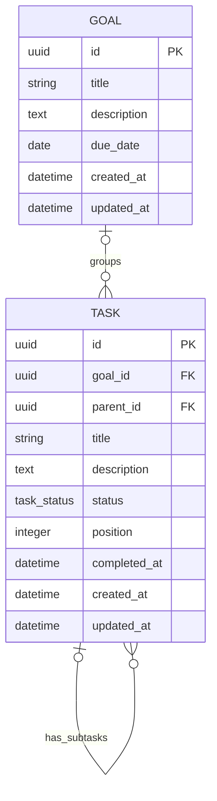

# 001 — Goals, Tasks, and Subtasks

> Establish the core planning system by letting a user organize work into goals,
> tasks, and one level of subtasks, and manage that work in list and Kanban views.

## Meta

| Field | Value |
|---|---|
| **Status** | Draft |
| **Author** | LARP project |
| **Created** | 2026-08-14 |
| **Updated** | 2026-08-14 |
| **Depends on** | [#000 — Base Spec](./00_base_spec.md) |
| **Supersedes** | — |

---

## Problem Statement

LARP needs a durable representation of what the user wants to achieve and the work
required to achieve it. The initial application has no way to capture large outcomes,
break them into actionable tasks, or visualize work as it moves toward completion.
Goals, tasks, and subtasks form the base data model that later planning, focus tracking,
progression, statistics, and AI-assistant features will build upon.

---

## Goals and Non-Goals

### Goals

- [ ] Let the user create, view, edit, and permanently delete goals.
- [ ] Let the user create, view, edit, move, close, reopen, and permanently delete tasks.
- [ ] Let a task optionally belong to a goal.
- [ ] Let a task have one level of subtasks.
- [ ] Show tasks in switchable list and Kanban views.
- [ ] Track the workflow states `BACKLOG`, `TODO`, `DOING`, `DONE`, and `CLOSED`.
- [ ] Calculate goal progress consistently from its associated tasks and subtasks.
- [ ] Persist all goal and task data in PostgreSQL and expose it through the FastAPI API.
- [ ] Provide responsive, keyboard-accessible web interfaces for the core workflows.

### Non-Goals

- Authentication, authorization, user accounts, teams, and shared goals or tasks.
- Recurring tasks, habits, reminders, notifications, or calendar synchronization.
- Task priority, labels, dependencies, attachments, comments, or time estimates.
- More than one level of subtasks.
- Custom Kanban columns or custom workflow states.
- Goal hierarchies, goal status, goal weighting, or manually entered goal progress.
- XP, levels, rewards, streaks, statistics, or focus-time calculations.
- AI-generated goals, task decomposition, or planning recommendations.
- Offline-first behavior, real-time collaboration, or optimistic conflict resolution.
- Bulk editing other than changing the view filters.

---

## Proposed Solution

### Overview

A goal represents a larger desired outcome, such as “Learn frontend development.” A task
represents actionable work and may stand alone or belong to a goal. A subtask is stored as
a task with a `parent_id`; the API and database enforce a maximum hierarchy depth of one.

The API is the source of truth for validation, ordering, status transitions, relationship
rules, and progress. It returns tasks as a flat collection with `parent_id` references so
the web client can render the same data in nested list and Kanban presentations.

This specification assumes a single-user installation. Records do not have an owner until
an authentication and account specification defines one.

### User Experience

#### Application navigation

The primary application navigation contains two destinations:

- **Goals** at `/goals`.
- **Tasks** at `/tasks`.

The current destination is visually identifiable. Navigation and all primary actions must
be usable with a keyboard and have visible focus states.

#### Goals list

The `/goals` page:

1. Lists goals ordered by nearest due date first, with goals without a due date last.
   Equal due dates are ordered by newest creation date first.
2. Shows each goal's title, optional due date, and progress as a percentage and fraction
   (for example, `60% · 3/5 tasks`).
3. Provides a **New goal** action that opens a form for title, description, and due date.
4. Lets the user open a goal's detail page.
5. Shows a clear empty state with a create action when no goals exist.

Create and edit forms validate inline. A successful mutation returns the user to the
relevant page and displays the saved server state. The UI must prevent accidental duplicate
submissions while a request is pending.

#### Goal detail

The `/goals/$goalId` page:

1. Shows the goal title, description, optional due date, and calculated progress.
2. Shows all tasks associated with the goal, with subtasks nested beneath their parent.
   Closed tasks are hidden by default and can be revealed with an **Include closed** toggle.
3. Lets the user create a task already associated with the goal.
4. Lets the user edit or delete the goal.
5. Lets the user open or edit an associated task using the same task form used on the
   Tasks page.

Deleting a goal requires confirmation. The dialog must state that the goal is permanently
deleted while its tasks are retained and become unassigned.

#### Tasks page

The `/tasks` page provides list and Kanban modes over the same task collection.

Common behavior in both modes:

- The page defaults to excluding `CLOSED` tasks.
- The user can filter by goal, including an **Unassigned** option.
- The user can include or hide closed tasks.
- The user can create a standalone task or select a goal during creation.
- The user can edit a task, add a subtask, close/reopen it, or permanently delete it.
- The selected view and filters are represented as validated URL search parameters so the
  page can be bookmarked and browser navigation behaves predictably.
- Loading, empty, request-failure, and retry states are shown without discarding the
  currently rendered data.

List mode:

- Displays top-level tasks in their stored order, with subtasks nested beneath each parent.
- Shows status, associated goal (if any), and completed/total subtask count.
- Supports changing status from the task actions.

Kanban mode:

- Displays columns for **Backlog**, **To Do**, **Doing**, and **Done**, in that order.
- Does not display a Closed column. If **Include closed** is enabled, closed tasks appear in
  a separate compact section below the board.
- Displays top-level tasks as cards. Each card shows its title, associated goal (if any),
  and completed/total subtask count.
- Supports moving a top-level task to another visible status and reordering it within a
  column using pointer-based drag and drop or an equivalent control.
- Provides keyboard-accessible status and ordering controls; drag and drop must not be the
  only way to move a task.
- Displays subtasks inside the task detail/edit interface rather than as separate cards.

#### Task and subtask forms

The task form contains:

- Title (required).
- Description (optional).
- Status (required, defaults to `BACKLOG`).
- Goal (optional for a top-level task; inherited and read-only for a subtask).

The add-subtask action is available only for a top-level task. A new subtask defaults to
`BACKLOG` and inherits its parent's goal. The form explains validation failures returned by
the API without closing or losing the entered values.

#### Error and edge states

- Unknown goal and task URLs render a not-found state with a route back to the relevant
  list, not a blank page.
- A goal whose due date is before the current local date is marked **Overdue**. Due dates
  are calendar dates and are not shifted by timezone conversion.
- A goal with no contributing tasks shows `0% · 0/0 tasks`.
- Destructive actions require an explicit confirmation and remain available only while no
  mutation is pending.
- If a record was deleted or changed before a submitted action completes, the UI displays
  the API error and refreshes the relevant query.

### Data Model

Persistence uses SQLAlchemy Core tables and PostgreSQL. Database-generated UUIDs and
timezone-aware timestamps are used throughout.

#### `goals`

| Column | Type | Null | Default | Constraints / meaning |
|---|---|---:|---|---|
| `id` | UUID | No | `gen_random_uuid()` | Primary key |
| `title` | `varchar(200)` | No | — | Trimmed; length 1–200 |
| `description` | `text` | No | `''` | Trimmed; maximum 10,000 characters |
| `due_date` | `date` | Yes | `NULL` | Calendar date, inclusive |
| `created_at` | `timestamptz` | No | `now()` | Immutable creation time |
| `updated_at` | `timestamptz` | No | `now()` | Updated on every mutation |

#### `task_status`

The task status is stored as a PostgreSQL enum with these stable API values:

| Value | User label | Meaning |
|---|---|---|
| `BACKLOG` | Backlog | Captured but not committed for immediate work |
| `TODO` | To Do | Ready to be worked on |
| `DOING` | Doing | Work is in progress |
| `DONE` | Done | Successfully completed |
| `CLOSED` | Closed | Removed from active work without counting as completed |

#### `tasks`

| Column | Type | Null | Default | Constraints / meaning |
|---|---|---:|---|---|
| `id` | UUID | No | `gen_random_uuid()` | Primary key |
| `goal_id` | UUID | Yes | `NULL` | FK to `goals.id`, `ON DELETE SET NULL` |
| `parent_id` | UUID | Yes | `NULL` | Self-FK to `tasks.id`, `ON DELETE RESTRICT` |
| `title` | `varchar(200)` | No | — | Trimmed; length 1–200 |
| `description` | `text` | No | `''` | Trimmed; maximum 10,000 characters |
| `status` | `task_status` | No | `BACKLOG` | Current workflow state |
| `position` | `integer` | No | assigned by service | Zero-based order within its sibling/status scope; non-negative |
| `completed_at` | `timestamptz` | Yes | `NULL` | Set while and only while status is `DONE` |
| `created_at` | `timestamptz` | No | `now()` | Immutable creation time |
| `updated_at` | `timestamptz` | No | `now()` | Updated on every mutation |

Required indexes:

- `tasks(goal_id)` for goal filtering and progress aggregation.
- `tasks(parent_id)` for subtask lookup and relationship validation.
- `tasks(status, parent_id, position)` for board/list retrieval.
- A unique constraint on `(parent_id, status, position)` is not required because PostgreSQL
  treats `NULL` parent values as distinct by default and ordering is normalized by the
  service. The API must still return deterministic order using `position`, then `created_at`,
  then `id`.

Relationship rules that require inspecting another row (maximum depth and inherited goal)
are enforced transactionally in the service layer. Database foreign keys protect basic
referential integrity.

### API Contracts

All endpoints use JSON under `/api/v1`. UUIDs are serialized as strings, timestamps as
UTC ISO 8601 strings, and dates as `YYYY-MM-DD`. Collection endpoints return a bare JSON
array in this MVP because pagination is out of scope.

The API uses these Pydantic schemas:

- `GoalCreate`: `title`, `description = ""`, `due_date = null`.
- `GoalUpdate`: optional versions of all editable goal fields; omitted and explicit `null`
  are distinct for `due_date`.
- `GoalRead`: persisted goal fields plus `progress`.
- `GoalProgress`: `completed_tasks`, `total_tasks`, and integer `percentage`.
- `TaskCreate`: `title`, `description = ""`, `status = "BACKLOG"`, `goal_id = null`,
  `parent_id = null`.
- `TaskUpdate`: optional editable task fields: `title`, `description`, `status`, `goal_id`,
  `parent_id`, and `position`.
- `TaskRead`: all persisted task fields plus `completed_subtasks` and `total_subtasks`.
- `ApiError`: `code`, `message`, and optional field-level `details`.

`PATCH` endpoints reject an empty request body. They update only fields present in the
request. Unknown fields are rejected.

#### Goal endpoints

| Method | Path | Response | Description |
|---|---|---|---|
| `GET` | `/api/v1/goals` | `200 list[GoalRead]` | List goals in the defined goal order |
| `POST` | `/api/v1/goals` | `201 GoalRead` | Create a goal |
| `GET` | `/api/v1/goals/{goal_id}` | `200 GoalRead` | Get one goal and current progress |
| `PATCH` | `/api/v1/goals/{goal_id}` | `200 GoalRead` | Partially update a goal |
| `DELETE` | `/api/v1/goals/{goal_id}` | `204` | Delete a goal and unassign its tasks |

#### Task endpoints

| Method | Path | Response | Description |
|---|---|---|---|
| `GET` | `/api/v1/tasks` | `200 list[TaskRead]` | List tasks using optional filters |
| `POST` | `/api/v1/tasks` | `201 TaskRead` | Create a top-level task or subtask |
| `GET` | `/api/v1/tasks/{task_id}` | `200 TaskRead` | Get one task, including a closed task |
| `PATCH` | `/api/v1/tasks/{task_id}` | `200 TaskRead` | Edit, move, reparent, close, or reopen a task |
| `DELETE` | `/api/v1/tasks/{task_id}` | `204` | Permanently delete a task with no subtasks |

Supported `GET /api/v1/tasks` query parameters:

| Parameter | Type | Default | Behavior |
|---|---|---|---|
| `goal_id` | UUID | omitted | Return tasks assigned to this goal |
| `unassigned` | boolean | `false` | Return only tasks whose `goal_id` is null |
| `status` | repeated enum | omitted | Return only the requested statuses |
| `parent_id` | UUID | omitted | Return direct subtasks of this task |
| `top_level_only` | boolean | `false` | Return only tasks whose `parent_id` is null |
| `include_closed` | boolean | `false` | Include `CLOSED` tasks in the result |

`goal_id` and `unassigned=true` are mutually exclusive. Unless `status=CLOSED` is
explicitly requested, `include_closed=false` excludes closed tasks. Results are ordered by
status in `BACKLOG`, `TODO`, `DOING`, `DONE`, `CLOSED` order, then `position`, `created_at`,
and `id`.

#### HTTP errors

| Status | When used |
|---|---|
| `400 Bad Request` | Malformed or contradictory query parameters |
| `404 Not Found` | Referenced goal, task, or parent does not exist |
| `409 Conflict` | Relationship/state conflict, such as deleting a task with subtasks |
| `422 Unprocessable Entity` | Field validation failure or prohibited hierarchy/goal assignment |

FastAPI's default validation response may be used for request-shape errors. Domain errors
must use `ApiError` with stable codes such as `GOAL_NOT_FOUND`, `TASK_NOT_FOUND`,
`INVALID_TASK_PARENT`, and `TASK_HAS_SUBTASKS`.

Authentication is not required in this specification. A future authentication spec must
add ownership checks without changing resource identifiers or the meaning of these routes.

### Frontend Components

Routes use TanStack Router's existing file-based routing. Server state is managed with
TanStack Query; API access is centralized in typed feature clients rather than called
directly from presentation components.

| Component / module | Suggested path | Responsibility |
|---|---|---|
| `AppShell` | `web/src/components/app-shell.tsx` | Primary Goals/Tasks navigation and page layout |
| Goals index route | `web/src/routes/goals/index.tsx` | Goals query, empty/error states, create action |
| Goal detail route | `web/src/routes/goals/$goalId.tsx` | Goal summary and associated task query/actions |
| Tasks route | `web/src/routes/tasks.tsx` | Validated view/filter search state and task query |
| `GoalForm` | `web/src/features/goals/components/goal-form.tsx` | Shared create/edit validation form |
| `GoalCard` | `web/src/features/goals/components/goal-card.tsx` | Goal summary and progress display |
| `GoalProgress` | `web/src/features/goals/components/goal-progress.tsx` | Accessible progress fraction and indicator |
| Goals API client | `web/src/features/goals/api.ts` | Typed goal requests and query keys |
| `TaskForm` | `web/src/features/tasks/components/task-form.tsx` | Shared task/subtask create and edit form |
| `TaskList` | `web/src/features/tasks/components/task-list.tsx` | Nested list representation |
| `TaskBoard` | `web/src/features/tasks/components/task-board.tsx` | Four active Kanban columns and move behavior |
| `TaskCard` | `web/src/features/tasks/components/task-card.tsx` | Task summary and actions |
| `TaskFilters` | `web/src/features/tasks/components/task-filters.tsx` | Goal, closed-state, and view controls |
| Tasks API client | `web/src/features/tasks/api.ts` | Typed task requests and query keys |

Component names and exact file boundaries may change during implementation, but route URLs,
contracts, behavior, and separation between feature API/state code and presentation code
are normative.

### Business Rules

1. Titles and descriptions are trimmed before persistence. A title containing only
   whitespace is invalid.
2. A task may have no goal, but a subtask always inherits its parent task's `goal_id`,
   including `NULL`.
3. Creating or reparenting a subtask with a different explicit `goal_id` is rejected.
4. Changing a top-level task's `goal_id` updates all its subtasks in the same transaction.
5. A task whose `parent_id` is non-null cannot itself be used as a parent. A task cannot be
   its own parent. These rules prevent cycles and enforce exactly one subtask level.
6. Reparenting is allowed only between top-level parents. The moved task inherits the new
   parent's goal and receives the last position among the new parent's subtasks in its
   current status.
7. Any status may transition directly to any other status. Moving to `DONE` sets
   `completed_at` to the transition time. Moving away from `DONE` clears `completed_at`.
   Patching a task that is already `DONE` without changing status preserves its timestamp.
8. `CLOSED` means excluded from active work, not completed. Closing a task clears
   `completed_at`. Reopening it requires selecting an active status.
9. Parent and subtask statuses do not change automatically. A parent may be marked `DONE`
   even if some subtasks remain incomplete; the UI should make that state visible but must
   not silently mutate the subtasks.
10. A task's `position` is scoped to tasks with the same `parent_id` and `status`. Creation
    appends it to the end of that scope. Moving or deleting a task compacts affected
    positions transactionally to contiguous zero-based values.
11. A task with subtasks cannot be permanently deleted. The API returns
    `409 TASK_HAS_SUBTASKS`; the user must delete its subtasks first. Closing the parent
    remains allowed and does not close its subtasks.
12. Deleting a goal does not delete tasks. PostgreSQL sets every associated task's
    `goal_id` to `NULL`; parent/subtask relationships are retained.
13. Goal progress includes every directly associated top-level task and subtask whose
    status is not `CLOSED`. A task contributes one unit regardless of hierarchy.
14. `completed_tasks` is the number of contributing tasks in `DONE`; `total_tasks` is the
    number of all contributing tasks. `percentage` is `floor(completed / total * 100)`, or
    `0` when total is zero.
15. Progress is computed when a goal is read or listed; no mutable percentage is stored on
    the goal.
16. Due date has no effect on status or progress and does not trigger notifications.
17. All writes that affect relationships, ordering, or multiple rows are atomic.

---

## Acceptance Criteria

1. Given no goals exist, when the user opens `/goals`, then an empty state and working
   **New goal** action are shown.
2. Given valid goal values, when the user creates a goal, then it persists across reloads
   and appears in the goals list with `0% · 0/0 tasks`.
3. Given a goal, when the user creates a task from its detail page, then the task is
   associated with that goal and appears on both the detail page and Tasks page.
4. Given a top-level task, when the user creates a subtask, then the subtask inherits the
   parent's goal and is shown nested beneath it in list views.
5. Given a subtask, when the user tries to add another child beneath it, then the API
   rejects the request and the UI explains that only one subtask level is supported.
6. Given tasks in multiple states, when the user opens Kanban mode, then the four active
   columns contain the correct top-level cards in deterministic order and no Closed column
   appears.
7. Given a task is moved between columns, when the request succeeds, then its status and
   position remain correct after reload.
8. Given a task is marked `DONE`, then `completed_at` is populated and associated goal
   progress updates. Reopening the task clears `completed_at` and updates progress again.
9. Given a task is `CLOSED`, then it is absent by default, appears when closed tasks are
   included, and does not contribute to goal progress.
10. Given a goal has two done tasks, one todo task, and one closed task, then its progress
    is `66%` with `completed_tasks=2` and `total_tasks=3`.
11. Given a goal with associated tasks, when the user confirms goal deletion, then the
    goal is gone and its tasks remain as unassigned tasks.
12. Given a task with subtasks, when permanent deletion is attempted, then no records are
    deleted and the user receives a conflict message.
13. Given view/filter search parameters, when the page is reloaded or shared, then the
    equivalent Tasks view is restored.
14. Given the API cannot be reached, then existing content is preserved where possible and
    an actionable retry state is displayed.

---

## Implementation Plan

### Local Infrastructure

1. Add a `postgres` service to the root `compose.yaml` using the project's supported
   PostgreSQL version. Configure a development database, user, password, named data volume,
   exposed local port, and `pg_isready` health check. The checked-in values must be safe
   development defaults and align with `api/.env.example`.
2. Add a root `package.json` script named `db:up` that runs
   `docker compose up --detach postgres`, allowing the development database to be started
   with `pnpm db:up` from the repository root.

### Backend

1. Add SQLAlchemy 2, an async PostgreSQL driver, and Alembic through `uv`; add typed database
   settings and document them in `api/.env.example` and `api/README.md`.
2. Add database engine/session lifecycle support under `api/src/core/` and make PostgreSQL
   connectivity part of `/health/ready` while keeping `/health/live` dependency-free.
3. Add shared metadata, UUID/timestamp helpers, and Alembic configuration.
4. Create `api/src/goals/` with table, schemas, repository, service, and router modules.
5. Create `api/src/tasks/` with status definition, table, schemas, repository, service, and
   router modules.
6. Implement relationship, progress, transition, and ordering rules in services using
   database transactions and row locking where ordering can race.
7. Register both routers in `create_app()` under `/api/v1`.
8. Add domain-error translation so known service errors have stable HTTP statuses/codes and
   unexpected errors do not leak database details.

### Frontend

1. Add and configure TanStack Query at the application root and create a shared typed HTTP
   client with normalized API errors.
2. Add the application shell and Goals/Tasks navigation.
3. Implement typed goal/task feature clients, query keys, mutations, and targeted cache
   invalidation.
4. Implement `/goals`, `/goals/$goalId`, and `/tasks` with validated path/search parameters.
5. Implement shared create/edit forms, confirmation dialogs, loading/empty/error states, and
   accessible notifications.
6. Implement nested list and four-column Kanban presentations, including pointer and
   keyboard task-move controls.
7. Generate the TanStack route tree and verify responsive layouts at narrow and wide widths.

### Migrations

1. Enable `pgcrypto` if `gen_random_uuid()` is not already available in the supported
   PostgreSQL version/configuration.
2. Create the `task_status` enum.
3. Create `goals`.
4. Create `tasks`, its foreign keys, checks, and indexes.
5. Verify both upgrade and downgrade paths against a disposable PostgreSQL database.

---

## Testing Strategy

### Backend Tests

- Table/migration tests cover constraints, foreign-key behavior, and upgrade/downgrade.
- Goal service tests cover trimming/validation, ordering, CRUD, progress with zero/mixed/
  closed tasks, and delete-to-unassigned behavior.
- Task service tests cover creation, transitions, timestamps, ordering normalization,
  reparenting, goal inheritance/cascade, maximum depth, and guarded deletion.
- Router tests cover success schemas, filters, default closed exclusion, contradictory query
  parameters, not-found responses, domain conflicts, and validation errors.
- Transaction tests verify a failed multi-row update leaves relationships and positions
  unchanged.
- Application tests verify both routers are registered and OpenAPI includes their schemas.

Backend tests that access persistence run against PostgreSQL rather than SQLite so enum,
UUID, constraint, and transaction behavior match production.

### Frontend Tests

- Add and configure Vitest and React Testing Library if they are not present when
  implementation begins.
- Test goal/task forms, field errors, pending state, and retained values after API failure.
- Test goal list and detail loading, empty, success, overdue, not-found, and retry states.
- Test list nesting and Kanban status/ordering rendering.
- Test view/filter URL state and default exclusion of closed tasks.
- Test task moves through both drag/pointer behavior and accessible non-drag controls.
- Test mutation success, domain conflicts, confirmation flows, and query invalidation.

### Manual Verification

1. From the repository root, run `pnpm db:up` and verify that the Compose `postgres` service
   starts, becomes healthy, and retains data across a container restart.
2. Start the API and web application against the Compose database from a clean schema.
3. Create goals with past, future, and absent due dates and verify ordering/overdue labels.
4. Create standalone and goal-associated tasks and subtasks; reload and verify persistence.
5. Move tasks through every status and reorder tasks within each Kanban column.
6. Toggle list/Kanban mode and filters; reload and use back/forward navigation.
7. Verify progress changes for done, reopened, and closed tasks and subtasks.
8. Delete a goal and verify its tasks become unassigned; attempt to delete a parent before
   and after deleting its subtasks.
9. Complete the primary flows using only a keyboard and at a narrow mobile viewport.
10. Run the repository's Ruff, pytest, Biome, TypeScript, Vitest, and production build
    checks.

---

## Open Questions

None. Product decisions for this MVP are recorded below and can be revised while the spec
remains in Draft.

---

## Decision Log

| Date | Decision | Rationale |
|---|---|---|
| 2026-08-14 | Keep the MVP single-user and omit ownership columns | Authentication is a separate concern and does not yet exist in the project. |
| 2026-08-14 | Limit subtasks to one level | Covers the stated use case while avoiding ambiguous deep-tree behavior in the first release. |
| 2026-08-14 | Treat `CLOSED` as inactive, not complete | Preserves the distinction between finished work and work intentionally removed from active planning. |
| 2026-08-14 | Count all non-closed tasks and subtasks equally toward goal progress | Provides a deterministic calculation without adding estimates or weights that are outside scope. |
| 2026-08-14 | Retain and unassign tasks when deleting a goal | Avoids surprising data loss while preserving independent task value. |
| 2026-08-14 | Return flat task collections with `parent_id` | Supports list and Kanban clients with one stable API representation and avoids recursive response contracts. |

---

## References

- [Project roadmap](../../ROADMAP.md)
- [Backend conventions](../../api/AGENTS.md)
- [Frontend conventions](../../web/AGENTS.md)
